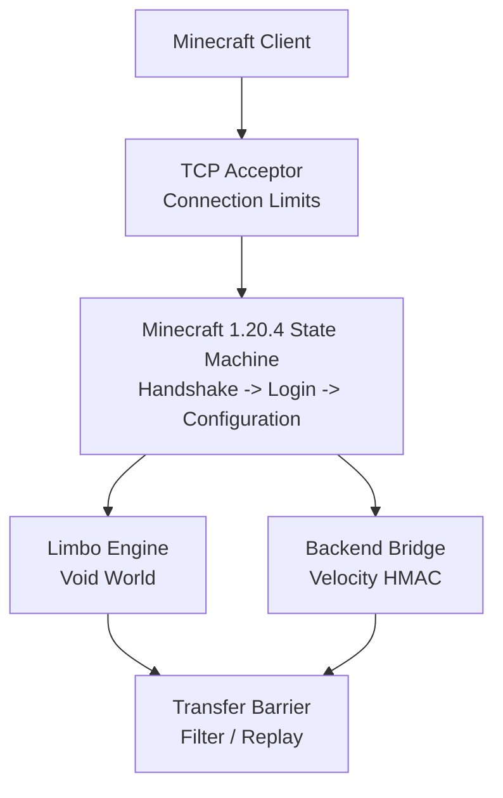

# RegionGate

RegionGate is a high-performance, lightweight Minecraft proxy and Limbo gateway written in Go. It is designed for anti-bot protection, player queues, backend routing, and low-latency traffic forwarding without JVM overhead.

The current implementation is an early MVP focused strictly on **Minecraft Java Edition 1.20.4** (protocol `765`). Multi-version support is intentionally out of scope until the session lifecycle and Limbo-to-backend transfer are stable.

## Goals

- Operate as the only public edge gateway in front of Paper, Purpur, or Fabric servers.
- Authenticate and validate players before they reach a backend.
- Hold players in a lightweight void Limbo during checks or queueing.
- Forward real IP addresses, UUIDs, and profile properties using Velocity Modern Forwarding.
- Transfer players from Limbo to a backend through the 1.20.4 Configuration state.
- Keep memory usage, allocations, and forwarding latency predictable under load.

## Architecture



Client and backend connections use separate transport state. Encryption, compression, framing, KeepAlive identifiers, and protocol states are never shared between sockets.

## Current Status

Implemented:

- Bounded Minecraft packet framing.
- Signed 32-bit VarInt codec.
- Handshake and server list status flow.
- Offline-mode Login Start and Login Success.
- Offline UUID generation compatible with `OfflinePlayer:<username>`.
- Minecraft 1.20.4 Configuration state.
- Anonymous NBT encoder and minimal registry data.
- Limbo Join Game initialization.
- One void chunk with 24 empty overworld sections.
- Chunk batch start and completion packets.
- Spawn position and player position/look.
- Teleport confirmation gate.
- Limbo KeepAlive validation.
- Movement packet validation.
- Session state machine and initial `TRANSFER_BARRIER` model.
- Latest-position coalescing and bounded pending command replay.
- Graceful listener shutdown and active connection cleanup.

Planned:

- Validation with a real vanilla Minecraft 1.20.4 client.
- Long-running Limbo worker and periodic KeepAlive scheduling.
- Client settings and additional Configuration packets.
- Backend connector for Paper, Purpur, and Fabric.
- Velocity Modern Forwarding with HMAC-SHA256.
- Full Limbo-to-backend transfer barrier.
- In-memory player queue and admission scheduler.
- Anti-bot checks and per-IP rate limiting.
- Online-mode RSA encryption and Mojang session validation.
- Compression and forwarding-path profiling.
- Metrics, health endpoints, and administrative API.

## Protocol Scope

RegionGate currently supports only:

```text
Minecraft Java Edition 1.20.4
Protocol version 765
Vanilla-compatible clients
Offline-mode login
```

The MVP does not currently support:

- Minecraft 1.21 or other protocol versions.
- Forge/FML handshakes.
- Using Velocity or BungeeCord as an upstream proxy.
- Bedrock Edition or Geyser-specific handling.
- Production-ready online-mode authentication.

## Project Layout

```text
cmd/regiongate/                  Application entry point
internal/protocol/codec/         VarInt, strings, and packet framing
internal/protocol/handshake/     Minecraft handshake state
internal/protocol/login/         Offline login packets
internal/protocol/configuration/ Configuration packets, NBT, registries
internal/protocol/play/          Limbo play packets and validation
internal/server/                 TCP acceptor and connection lifecycle
internal/session/                Session state and transfer barrier
```

## Development

Requirements:

- Go `1.26` or newer.
- Git.

Run all tests:

```bash
go test ./...
```

Run static analysis:

```bash
go vet ./...
```

Format the code:

```bash
gofmt -w .
```

Run the race detector in an environment with CGO enabled:

```bash
CGO_ENABLED=1 go test -race ./...
```

## Running

The application entry point currently initializes the project but does not yet expose a production configuration or start the TCP server automatically:

```bash
go run ./cmd/regiongate
```

Server startup, configuration loading, and operational endpoints will be connected after the protocol lifecycle is validated with a real 1.20.4 client.

## Security Model

The intended production topology is:

```text
Internet -> RegionGate -> Paper / Purpur / Fabric
```

Backends must be closed to public traffic by firewall rules. RegionGate will be the single source of truth for authentication, anti-bot decisions, queue admission, and signed player forwarding. Velocity Modern Forwarding secrets must never be logged or exposed through administrative APIs.

## License

A project license has not been selected yet. Until a license is added, the source code remains under default copyright protection.
