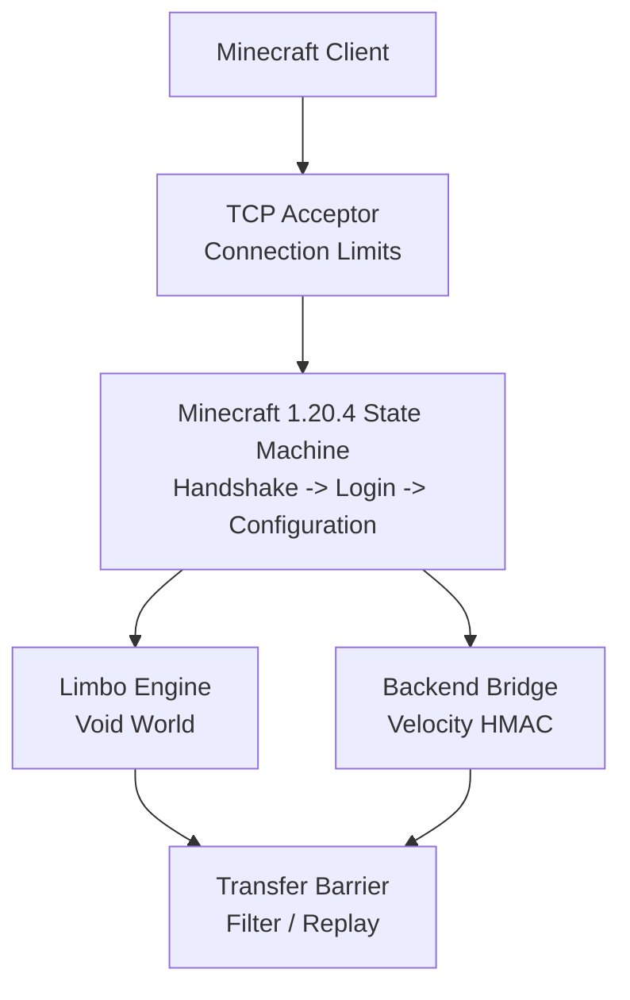

# RegionGate

RegionGate is a high-performance, lightweight Minecraft proxy and Limbo gateway written in Go. It is designed for anti-bot protection, player queues, backend routing, and low-latency traffic forwarding without JVM overhead.

The current implementation is an early MVP focused strictly on **Minecraft Java Edition 1.20.4** (protocol `765`). Multi-version support is intentionally out of scope until the session lifecycle and Limbo-to-backend transfer are stable.

## Goals

- Operate as the only public edge gateway in front of Paper, Purpur, or Fabric servers.
- Authenticate and validate players before they reach a backend.
- Hold players in a lightweight void Limbo during checks or queueing.
- Forward real IP addresses, UUIDs, and profile properties using Velocity Modern Forwarding.
- Transfer players from Limbo to a backend through the 1.20.4 Configuration state.
- Keep memory usage, allocations, and forwarding latency predictable under load.

## Architecture



Client and backend connections use separate transport state. Encryption, compression, framing, KeepAlive identifiers, and protocol states are never shared between sockets.

## Current Status

Implemented:

- Bounded Minecraft packet framing.
- Signed 32-bit VarInt codec.
- Handshake and server list status flow.
- Offline-mode Login Start and Login Success.
- Opt-in online-mode RSA encryption and Mojang session validation.
- Offline UUID generation compatible with `OfflinePlayer:<username>`.
- Minecraft 1.20.4 Configuration state.
- Client Information and Configuration plugin-message validation.
- Anonymous NBT encoder and minimal registry data.
- Limbo Join Game initialization.
- One void chunk with 24 empty overworld sections.
- Chunk batch start and completion packets.
- Spawn position and player position/look.
- Teleport confirmation gate.
- Limbo KeepAlive validation.
- Movement packet validation.
- Session state machine and initial `TRANSFER_BARRIER` model.
- Latest-position coalescing and bounded pending command replay.
- Graceful listener shutdown and active connection cleanup.
- Environment-based service configuration and health endpoint.
- Independent client and backend transports with single writer loops.
- Independent bounded Minecraft compression state per transport.
- Independent AES-CFB8 stream state per transport.
- Backend dialer, Login, Configuration, and Play bridge.
- Velocity Modern Forwarding payloads with HMAC-SHA256.
- Admission-triggered Limbo-to-backend transfer barrier.
- Backend and Limbo KeepAlive isolation.
- Asynchronous Limbo challenge hooks before queue admission.
- Paper 1.20.4 and FabricProxy-Lite 2.7.0 forwarding integration tests.
- Allocation and throughput benchmarks with zlib pooling.
- Opt-in pprof endpoint with graceful shutdown.
- Read-only Prometheus metrics and admin status endpoints.
- Backend protocol health state after Login and Configuration.
- Vanilla Minecraft 1.20.4 client validation through Login, Configuration,
  Join Game, void chunk initialization, teleport confirmation, and Limbo
  KeepAlive handling.

The vanilla validation uses the unmodified Mojang 1.20.4 client in offline
mode. A successful run remains connected in Limbo across multiple KeepAlive
intervals without registry, packet decoder, or protocol-state errors.

The same unmodified client was also verified end to end through the transfer
barrier into Paper 1.20.4 with Velocity forwarding enabled: the client
received the backend join chat message, Paper logged the forwarded player UUID
and login, and the gateway reported a healthy backend state.

## Protocol Scope

RegionGate currently supports only:

```text
Minecraft Java Edition 1.20.4
Protocol version 765
Vanilla-compatible clients
Offline-mode login by default
Opt-in online-mode login
```

The MVP does not currently support:

- Minecraft 1.21 or other protocol versions.
- Forge/FML handshakes.
- Using Velocity or BungeeCord as an upstream proxy.
- Bedrock Edition or Geyser-specific handling.

## Project Layout

```text
cmd/regiongate/                  Application entry point
internal/protocol/codec/         VarInt, strings, and packet framing
internal/protocol/handshake/     Minecraft handshake state
internal/protocol/login/         Offline login packets
internal/protocol/configuration/ Configuration packets, NBT, registries
internal/protocol/play/          Limbo play packets and validation
internal/server/                 TCP acceptor and connection lifecycle
internal/session/                Session state and transfer barrier
```

## Development

Requirements:

- Go `1.26` or newer.
- Git.

Run all tests:

```bash
go test ./...
```

Run static analysis:

```bash
go vet ./...
```

Format the code:

```bash
gofmt -w .
```

Run the race detector in an environment with CGO enabled:

```bash
CGO_ENABLED=1 go test -race ./...
```

On Windows, run the same check in the pinned Linux toolchain container:

```powershell
docker run --rm --volume "${PWD}:/src" --workdir /src golang:1.26 go test -race ./...
```

Run the real Paper 1.20.4 Velocity forwarding integration test with Docker:

```bash
REGIONGATE_RUN_PAPER_INTEGRATION=1 go test -tags=integration ./integration/paper -v
```

To run the Paper integration test without downloading from PaperMC, set
`REGIONGATE_PAPER_JAR` to a local 1.20.4 Paper jar. The harness mounts it into
the temporary container and switches the image to `CUSTOM` mode.

The test starts an ephemeral Paper container and verifies both a successful
forwarding login and rejection of an invalid Velocity secret.

Run the FabricProxy-Lite integration test:

```bash
REGIONGATE_RUN_FABRIC_INTEGRATION=1 go test -tags=integration ./integration/fabric -v
```

It uses Fabric 1.20.4 and FabricProxy-Lite 2.7.0 from Modrinth.

Run the Purpur 1.20.4 integration test:

```bash
REGIONGATE_RUN_PURPUR_INTEGRATION=1 go test -tags=integration ./integration/purpur -v
```

Run the performance baseline with allocation counts:

```bash
go test ./internal/protocol/codec ./internal/transport ./internal/session -run '^$' -bench . -benchmem
```

## Running

Start the Minecraft listener and health endpoint:

```bash
go run ./cmd/regiongate
```

Defaults:

```text
Minecraft: :25565
Health:    127.0.0.1:8080/healthz
Readiness: 127.0.0.1:8080/readyz
```

Backend transfer is enabled when both variables are configured:

```text
REGIONGATE_BACKEND_ADDRESS=127.0.0.1:25566
REGIONGATE_VELOCITY_SECRET=change-me
```

Online-mode authentication is opt-in:

```text
REGIONGATE_ONLINE_MODE=true
```

When enabled, RegionGate performs the Minecraft RSA/AES handshake and validates
the player through Mojang's `hasJoined` session endpoint before entering Limbo.

Optional variables include `REGIONGATE_LISTEN`, `REGIONGATE_HEALTH_LISTEN`,
`REGIONGATE_PPROF_LISTEN`, `REGIONGATE_ADMIN_TOKEN`,
`REGIONGATE_BACKEND_HOST`, `REGIONGATE_BACKEND_PORT`, and
`REGIONGATE_MAX_CONNECTIONS`, `REGIONGATE_MAX_CONNECTIONS_PER_IP`,
`REGIONGATE_QUEUE_SIZE`, and `REGIONGATE_ADMISSION_INTERVAL`.
Login throttling is configured with `REGIONGATE_LOGIN_RATE_LIMIT` and
`REGIONGATE_LOGIN_RATE_WINDOW`.

The optional local bot filter is enabled by setting
`REGIONGATE_CONFIG_FILE=/etc/regiongate/botfilter.example.yaml` (or another
mounted policy file). Without this variable, the gateway logs a warning and
keeps the filter disabled. Policy reloads are picked up automatically.

Profiling is disabled unless `REGIONGATE_PPROF_LISTEN` is set. Bind it to a
private address, then use the standard Go tools:

```bash
REGIONGATE_PPROF_LISTEN=127.0.0.1:6060 go run ./cmd/regiongate
go tool pprof http://127.0.0.1:6060/debug/pprof/heap
```

`/metrics` is served on the health listener. `/admin/status` is disabled unless
`REGIONGATE_ADMIN_TOKEN` contains at least 32 bytes and requests include
`Authorization: Bearer <token>`. Keep the listener private even when the token
is configured.

## Security Model

The intended production topology is:

```text
Internet -> RegionGate -> Paper / Purpur / Fabric
```

Backends must be closed to public traffic by firewall rules. RegionGate will be the single source of truth for authentication, anti-bot decisions, queue admission, and signed player forwarding. Velocity Modern Forwarding secrets must never be logged or exposed through administrative APIs.

## Production Docker

Copy `.env.production.example` to `.env`, replace both secrets, then start the
gateway and Paper backend:

```text
docker compose --env-file .env -f compose.production.yml up --build -d
```

If Docker cannot resolve `fill.papermc.io`, download or obtain a Paper
1.20.4 jar separately and start with the local-jar override:

```powershell
$env:PAPER_JAR_PATH = "C:\path\paper-1.20.4.jar"
docker compose --env-file .env -f compose.production.yml -f compose.production.local-paper.yml up --build -d
```

Only the RegionGate Minecraft listener is published. Paper and the health,
metrics, and admin endpoints remain on the internal Docker network. The
RegionGate container runs as a non-root user with a read-only filesystem,
dropped capabilities, and resource limits.

## License

A project license has not been selected yet. Until a license is added, the source code remains under default copyright protection.
